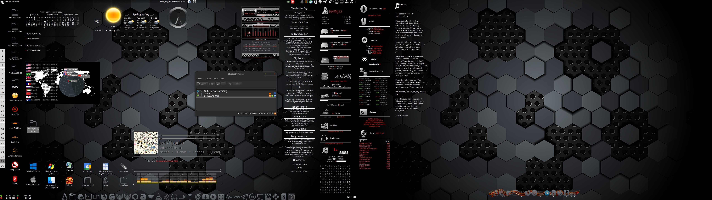
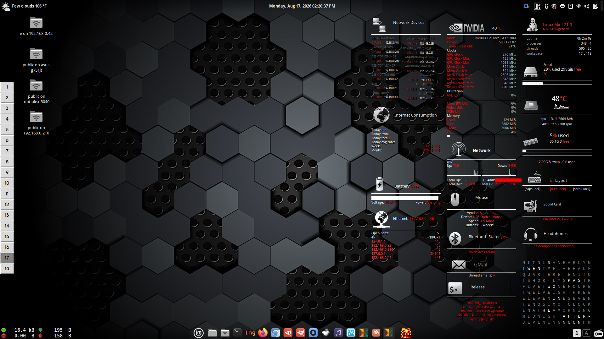

# Grey-Conky-System
A series of conky widgets re-created and expanded from a Deviant Art Conky posting from 2013

This is a series of conky widgets, shown in the example images on a 2560x1440 resolution PC and a 1920x1080 resolution laptop.

You may pick and choose widgets and build up any minimalis style array you wish based on your use case (wired vs wireless internet connection, lapatop w/battery or not etc)

The widgets will need editing to work on your system. Filepaths to .lua files and bash scripts must be changed to match your system file structure. Bash scripts must have a $ chown -x performed to operate. In cases of temperature and fan sensors, you must edit to the correct HWMON path for your system.

Note that only the widgets of the Grey Conky Minimalis are included here, other conkys shown such as the Text-Minimalis and the Static-Lyrics-display will be available at other repositories.

Enjoy!

